<div align="center">

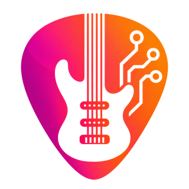

# GuitarLab

[English](README.md) · **Português** · [Español](README.es.md)

App desktop para consolidar o setlist da banda e estudar guitarra — tablaturas
Guitar Pro, vídeos do YouTube, cifra/letra, cifra automática detectada do áudio,
afinação, separação de stems na GPU e controle de progresso por trecho.

Electron + React + TypeScript + SQLite. Visual dark neumorphism.

[](https://github.com/paulobrandaodev/GuitarLab/actions/workflows/ci.yml)
[](LICENSE)
<br>
[](https://github.com/sponsors/paulobrandaodev)
[](https://ko-fi.com/paulobrandaodev)

<br>

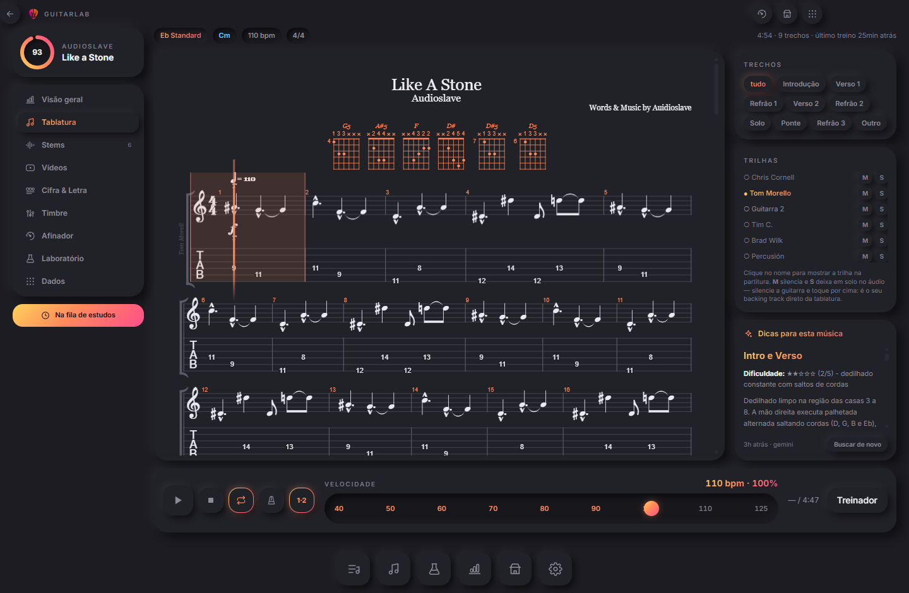

<sub>Mais telas abaixo — <a href="#telas">Telas</a></sub>

</div>

---

## Instalar

Baixe um instalador em [Releases](https://github.com/paulobrandaodev/GuitarLab/releases):

| Sistema | Arquivo |
|---|---|
| Windows | `GuitarLab-<versão>-instalador.exe`, ou a versão portátil |
| Linux | `.AppImage` (não instala nada) ou `.deb` |

**Nada mais para instalar.** O app precisa do [FFmpeg](https://ffmpeg.org/) e,
se ele ainda não estiver no seu `PATH`, há um botão em Ajustes que baixa e
instala para você. O laboratório de áudio — separação de stems e análise —
também se instala de dentro do app, então não há Python nem Docker para
configurar.

Tudo, menos o laboratório, funciona assim que o instalador termina.

**Os builds de Windows não são assinados.** O SmartScreen vai dizer "editor
desconhecido": clique em *Mais informações* → *Executar assim mesmo*. Um
certificado custa US$ 200–400 por ano, o que não se justifica num projeto livre
feito por hobby. Se isso te incomoda, compile você mesmo — instruções abaixo.

### Do código-fonte

```bash
git clone https://github.com/paulobrandaodev/GuitarLab.git
cd GuitarLab
npm install          # já compila o better-sqlite3 para o Electron
npm run dev          # desenvolvimento, com hot reload
npm run build        # gera out/
npm start            # roda o build
```

Node 22+. Não há passo de migração de banco: o schema é criado na primeira
abertura.

### Laboratório de áudio (opcional)

Separação de stems, BPM e grade de batidas, tom e acordes, áudio→MIDI e
transcrição de letra. **O app funciona inteiro sem ele** — fica desligado até
você instalar, e toda tela que o usa diz isso em vez de quebrar.

Instala-se de dentro do app: abra a aba **Laboratório** e escolha um pacote.

| Pacote | Download | Em disco | Para |
|---|---|---|---|
| Processador (CPU) | ~400 MB | ~1,8 GB | qualquer máquina |
| NVIDIA (CUDA) | ~2,7 GB | ~7 GB | placa NVIDIA, driver 525+ |

O app baixa o [uv](https://github.com/astral-sh/uv), pede a ele um CPython 3.10
só seu, monta um virtualenv e instala PyTorch, Demucs, librosa, basic-pitch e
faster-whisper ali dentro. Nada disso vai no instalador — é por isso que o
instalador tem ~116 MB e não vários gigabytes. Os pesos dos modelos são outro
download à parte, listados com o tamanho e baixados pelo botão de cada linha.

**O pacote CUDA precisa só do driver da NVIDIA.** Nada de CUDA Toolkit, nada de
Container Toolkit, nada de Docker — o runtime do CUDA vem dentro dos pacotes
`nvidia-*-cu12` que o PyTorch arrasta. Essa é a razão prática de o container ter
saído: a GPU deixou de exigir "instale o Docker Desktop e um runtime de
container" e passou a exigir "você já tem o driver".

Tudo fica na pasta de dados do app, e **Remover o laboratório** desfaz.

---

## Como usar

1. Coloque arquivos `.gp3/.gp4/.gp5/.gp7/.gpx/.gp/.gtp` em [gptabs/](gptabs/) e áudios (`mp3/wav/flac/m4a/ogg`) em [songs/](songs/).
2. Abra o app → **Importar pastas**.
3. As músicas aparecem com afinação, andamento, tonalidade, seções, letra e acordes já extraídos dos arquivos Guitar Pro.
4. Adicione ao setlist, abra **Estudar** e comece.
5. Sem arquivo nenhum? **Nova música** e **Novo setlist**, na tela de Setlist,
   criam os dois na mão — só o título do setlist, e o título e o artista da
   música, são obrigatórios. O resto (álbum, duração, tom, andamento,
   afinação…) fica para quando você souber, ou vem sozinho quando a tablatura
   ou o áudio chegar.

O casamento entre tablatura e áudio é **por metadado** (ID3 no MP3, RIFF INFO no WAV, cabeçalho do GP). `02.-Master Of Puppets.wav` e `master_of_puppets_metallica_gp_v2.gp` viram uma música só, automaticamente. Sem tags, cai para nome de arquivo normalizado com comparação fuzzy.

---

> **Sobre o idioma da interface:** o GuitarLab pega o idioma do sistema
> operacional e dá para trocar em Ajustes. A tradução está no meio do caminho: o
> encanamento, os rótulos compartilhados e a tela de Ajustes já falam os três
> idiomas, e o resto das telas continua só em português. Migrar uma tela é uma
> tarefa fechada em si e uma primeira contribuição bem útil; veja o
> [CONTRIBUTING.md](CONTRIBUTING.md#translations).

---

## Telas

Isto é o app rodando numa biblioteca de verdade — setlist real, tablaturas
reais, stems reais, histórico de treino real. Nada aqui é mockup: as imagens são
tiradas pelo [`scripts/screenshots.mjs`](scripts/screenshots.mjs), que sobe o app
e o dirige, então elas são regeradas em vez de refeitas na mão.

<table>
<tr>
<td width="50%">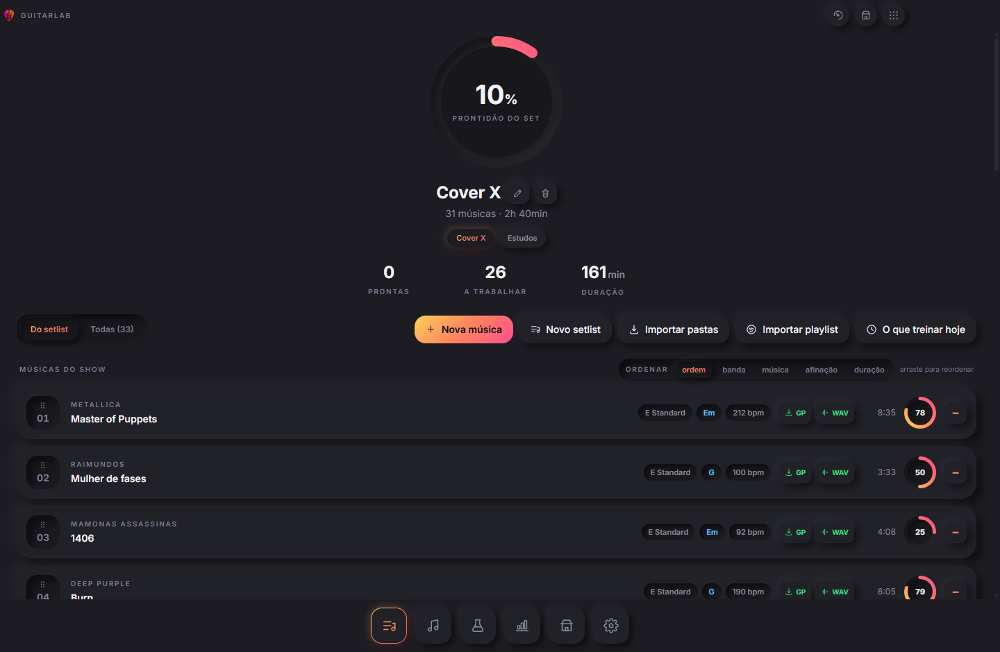</td>
<td width="50%">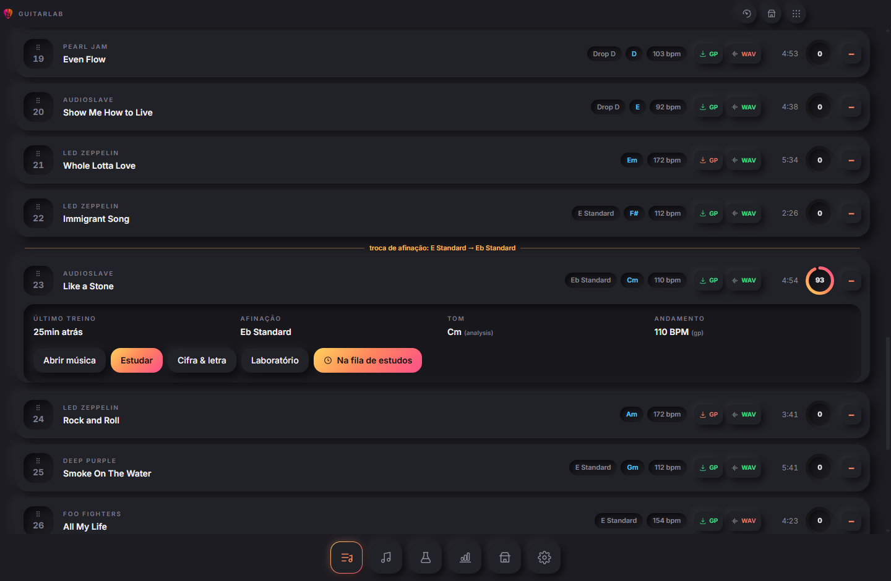</td>
</tr>
<tr>
<td><b>Setlist</b> — anel de prontidão do show, domínio por música e aviso quando duas faixas seguidas pedem afinações diferentes. Ordenação por banda, música, afinação (E padrão sempre no topo) e duração.</td>
<td><b>Cada linha abre onde está</b> — último treino, afinação, tom e andamento, mais os atalhos <b>GP</b> e <b>WAV</b> que buscam a tablatura e baixam a faixa.</td>
</tr>
<tr>
<td>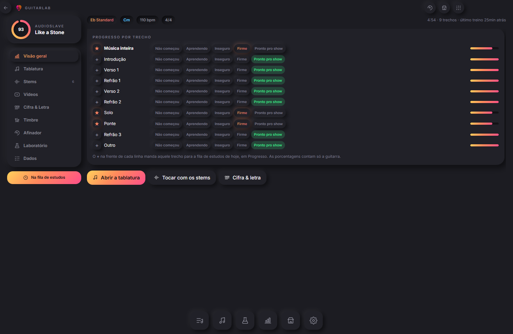</td>
<td></td>
</tr>
<tr>
<td><b>Música</b> — progresso por trecho, não por música. Vinte e sete deles aqui, cada um andando de <i>não começou</i> até <i>pronto pro show</i> por conta própria, com BPM alvo individual.</td>
<td><b>Estudar — Guitar Pro</b> — partitura e tablatura (alphaTab), transporte com loop A/B por trecho, slider de velocidade, metrônomo, contagem, mute/solo por trilha, treinador de velocidade.</td>
</tr>
<tr>
<td>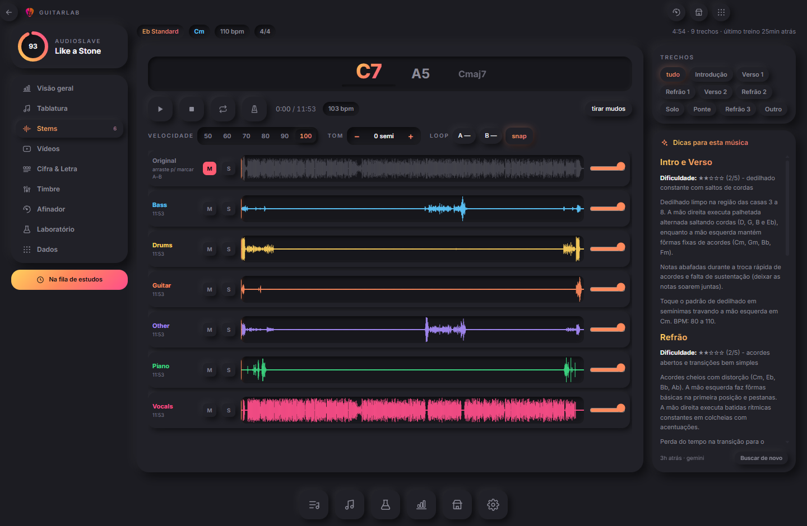</td>
<td>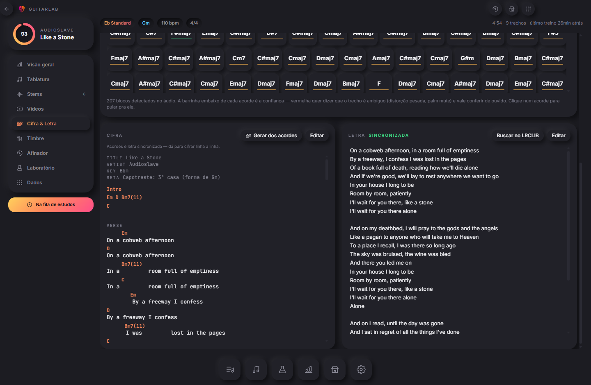</td>
</tr>
<tr>
<td><b>Estudar — Stems</b> — velocidade de 50% a 100% sem mexer no tom, transposição por semitom sem mexer na velocidade, loop A–B arrastado na forma de onda com encaixe na batida, metrônomo trancado no áudio, mute/solo e volume por faixa.</td>
<td><b>Cifra</b> — a cifra detectada direto do áudio e sincronizada com ele, com o acorde atual ao lado do anterior e dos dois seguintes. A barrinha embaixo de cada bloco é a confiança: vermelha quer dizer trecho ambíguo, que vale conferir de ouvido.</td>
</tr>
<tr>
<td>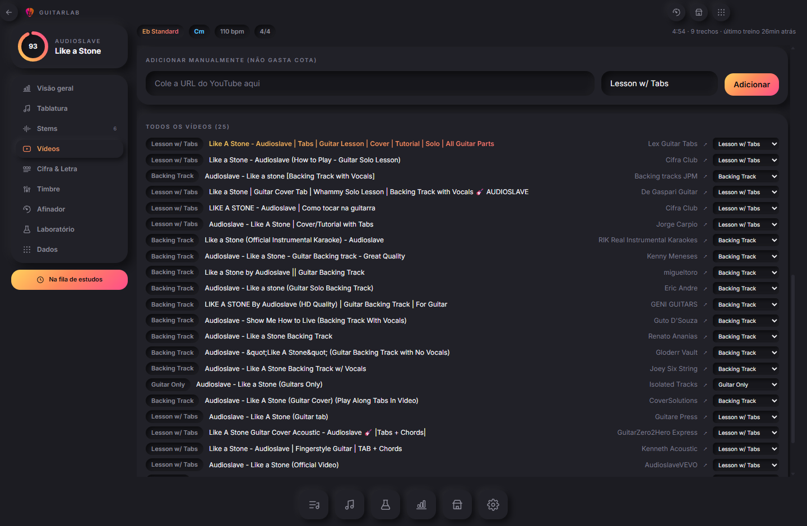</td>
<td>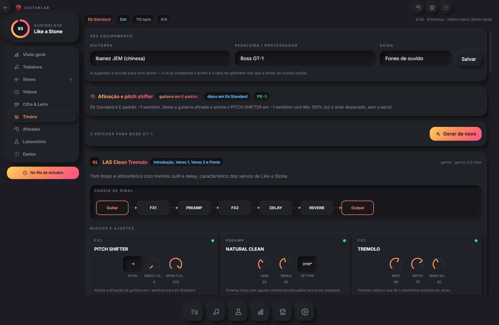</td>
</tr>
<tr>
<td><b>Vídeos</b> — uma busca por música, 25 resultados classificados localmente em Lesson w/ Tabs, Backing Track e Guitar Only, e guardados para sempre. Colar uma URL na mão não gasta cota nenhuma.</td>
<td><b>Timbre</b> — patches escritos para o equipamento que você tem de verdade e para os trechos que você toca, com a cadeia de sinal e cada botão que o patch espera que você ajuste.</td>
</tr>
<tr>
<td>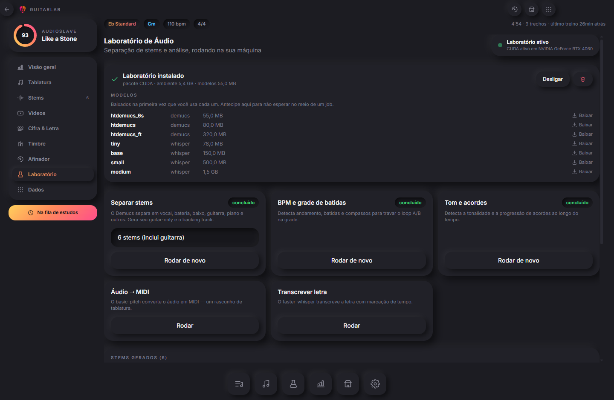</td>
<td>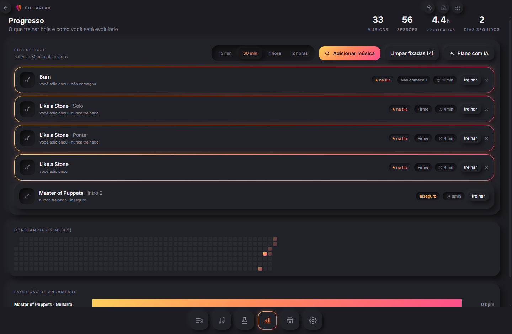</td>
</tr>
<tr>
<td><b>Laboratório</b> — separação de stems (Demucs), BPM e batidas, tom mais trilha de acordes, áudio→MIDI, transcrição de letra. Totalmente opcional: nesta imagem o container está desligado, e o app avisa em vez de quebrar.</td>
<td><b>Progresso</b> — fila do dia (SRS), heatmap de constância, curva de BPM, plano de treino gerado por IA.</td>
</tr>
<tr>
<td>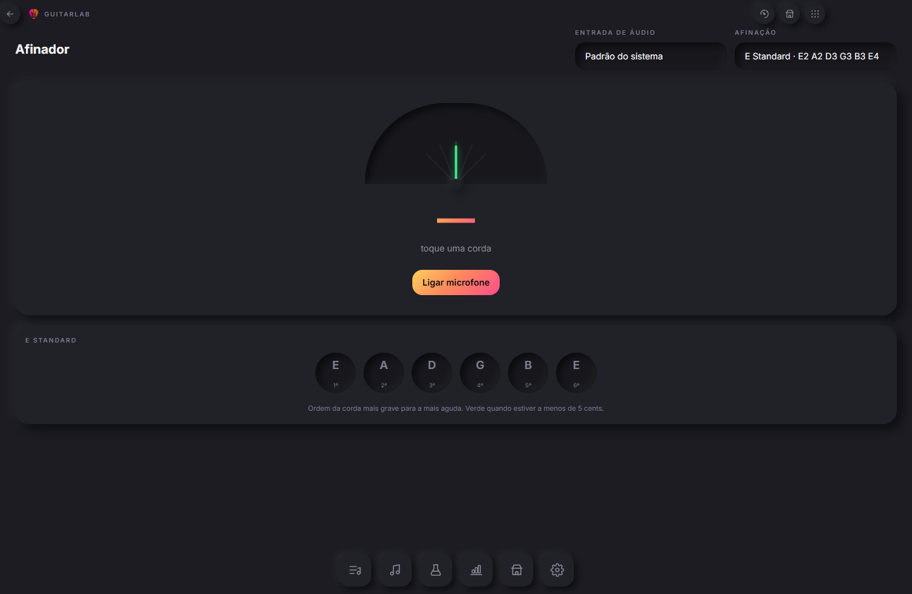</td>
<td>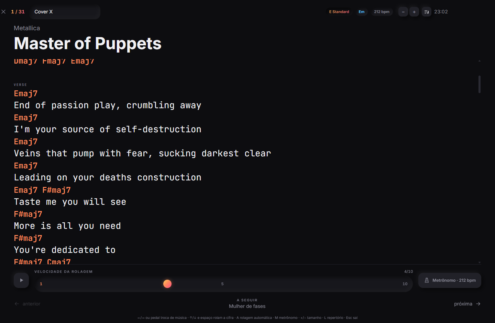</td>
</tr>
<tr>
<td><b>Afinador</b> — microfone e detecção de pitch, com o preset vindo do arquivo GP.</td>
<td><b>Modo Palco</b> — tela cheia, cifra grande e ajustável, rolagem automática em dez velocidades, metrônomo no BPM da música, repertório com as trocas de afinação, avanço por teclado ou pedal (setas / PageUp / PageDown).</td>
</tr>
</table>

---

## Configuração

Abra o app, vá em **Ajustes** e cole as chaves que você tiver. **Toda integração
é opcional** — cada uma que faltar apenas desliga o recurso dela e diz o que está
faltando.

As chaves são criptografadas pelo próprio sistema operacional (DPAPI no Windows,
Keychain no macOS, libsecret no Linux) e nunca saem da máquina. Se o sistema se
recusar a criptografar — um Linux sem keyring, por exemplo — o app não grava
nada, em vez de gravar em texto puro, e explica o porquê.

| Integração | Para que serve | Onde pegar a chave |
|---|---|---|
| **Gemini / OpenAI / Groq** | Plano de treino, análise de técnica, patches de timbre | [aistudio.google.com](https://aistudio.google.com/apikey) · [platform.openai.com](https://platform.openai.com/api-keys) · [console.groq.com](https://console.groq.com/keys) |
| **Ollama** | O mesmo, rodando local — sem chave, nada sai da sua máquina | [ollama.com](https://ollama.com) |
| **YouTube** | Buscar aulas, backing tracks e playthroughs | [console.cloud.google.com](https://console.cloud.google.com) → YouTube Data API v3 |
| **Spotify** | Metadados e comandar o Spotify que já está aberto | [developer.spotify.com](https://developer.spotify.com/dashboard) |

**Não precisam de chave:** LRCLIB (letra sincronizada), MusicBrainz, archive.org
(download de áudio), alphaTab e toda a IA local.

Rodando a partir de um clone, um `.env` na raiz também funciona — copie o
[.env.example](.env.example). A precedência é: variável de ambiente > o que você
salvou em Ajustes > `.env` > padrão. A tela de Ajustes mostra qual delas está
valendo em cada campo, para que uma variável de ambiente sobrepondo em silêncio
uma chave recém-colada seja visível em vez de incompreensível.

Tokens OAuth ficam criptografados no banco com `safeStorage`, nunca no `.env`.

---

## Decisões que valem saber

**Spotify não fornece mais BPM nem tom.** Os endpoints `audio-features` e `audio-analysis` foram descontinuados em nov/2024 para apps novos, sem substituto. Esses dados vêm do arquivo Guitar Pro ou da análise local. Fevereiro/2026 também cortou `search` para 10 resultados e removeu busca em lote, então o cliente usa fila limitada e cache agressivo.

**Reprodução do Spotify é via Connect**, não embutida. O Web Playback SDK exige DRM Widevine, que o Electron padrão não traz — só um fork com assinatura VMP. O app comanda o Spotify que já está aberto na máquina. O driver fica atrás de uma interface, então trocar depois é plugar outra implementação.

**YouTube: uma busca por música, não três.** A cota gratuita são ~100 buscas/dia. O app faz uma busca com 25 resultados e classifica localmente nos papéis (Lesson w/ Tabs, Backing Track, Guitar Only) por regex + reputação de canal, com re-rank por IA só nos casos ambíguos. Resultado fica em cache permanente, e há o caminho manual de colar URL, que não gasta cota.

**Cifras são coladas, não raspadas.** Ultimate Guitar e CifraClub não têm API pública e raspar viola os termos deles. O app tem editor ChordPro com conversão por IA de texto colado, e deep link para o site.

**Tablatura: o app não baixa, mas recebe.** Pela mesma razão acima, o botão **GP** abre a busca do Ultimate Guitar já filtrada em `type=500` (só Guitar Pro) com `rating[0]=4&rating[1]=5` — os parâmetros são os que a própria página usa nos filtros "Guitar Pro Tab" e "High rated", então acompanham o site em vez de adivinhar. A janela que abre tem os downloads interceptados: o arquivo que você clicar cai direto em [gptabs/](gptabs/) e é importado na música de origem, sem passar pela pasta Downloads. Quem escolhe e clica é você; o app só decide onde o arquivo mora. A sessão é persistente e separada da do app, então um login Pro sobrevive entre execuções. O CifraClub entra como alternativa, resolvido para a página exata da música pelo mesmo autocomplete que a busca do site usa.

**Áudio vem do archive.org, e esse é automático.** O archive.org tem busca e metadados públicos, então o botão **WAV** faz o caminho inteiro: procura o item, pontua faixa por faixa contra o título e o artista da música (o mesmo casador do importador), prefere wav/flac a mp3, baixa para [songs/](songs/) e importa — duração, loudness EBU R128 e forma de onda saem na hora. Download parcial é apagado: um wav truncado em `songs/` viraria uma faixa corrompida para sempre.

**O laboratório é um processo filho, não um container.** Começou em Docker, o que funcionava e custava a feature inteira para quem não é desenvolvedor: instale o Docker Desktop, depois o NVIDIA Container Toolkit, depois rode `npm run lab:up` num terminal — e só então a aba Laboratório faz alguma coisa. Hoje é um virtualenv que o próprio app monta e um `uvicorn` que ele sobe e mata junto com a janela. O contrato HTTP não mudou em nada — o `lab.ts` continua falando com uma URL —, e foi isso que tornou a troca segura.

Duas coisas caíram fora junto. A tradução de caminhos sumiu: quem chama e quem executa enxergam o mesmo sistema de arquivos, então um caminho que chega é um caminho que abre. E o interpretador ficou no 3.10 em vez do 3.11, porque o `basic-pitch` torna o TensorFlow uma dependência obrigatória do 3.11 para cima — 600 MB e vinte e cinco pacotes a mais por um modelo que roda na CPU de qualquer jeito. As duas resoluções foram comparadas com `uv pip compile` antes da escolha; o 3.10 cai no mesmo numpy 1.26.4 do container.

**Cifra automática, no estilo Chordify.** O `/harmony` do laboratório deixou de devolver só o tom: ele rastreia as batidas, tira um chroma por batida do sinal harmônico (percussão borra o chroma) e casa contra gabaritos de acorde — maior, menor, 7, m7, maj7 e power chord, que é metade de um riff de metal. O passe final é um Viterbi com penalidade fixa para trocar de acorde; sem ele o rótulo muda a cada batida e não dá para ler. A tela mostra os blocos na ordem, acende o que está tocando, pula para o trecho no clique e transpõe por semitom. A barrinha embaixo de cada acorde é a confiança — vermelha quer dizer trecho ambíguo, vale conferir de ouvido.

**Velocidade e tom são controles separados, e isso custou um worklet.** No Web Audio, `playbackRate` e `detune` são a mesma coisa — reamostragem — então meia velocidade também é uma oitava abaixo, o que não serve para estudar riff nenhum. Quem separa os dois é o SoundTouch (time-stretch WSOLA + transpositor de taxa) rodando como AudioWorklet. A divisão de trabalho não é óbvia pelos nomes: quem muda a velocidade continua sendo a *fonte*, com o `playbackRate` dela, e o parâmetro `playbackRate` do nó diz ao processador o quanto empurrar o tom de volta (ele calcula `pitch × 2^(semitons/12) ÷ playbackRate`). Ou seja, os dois recebem o mesmo número, e `pitchSemitones` é a transposição livre por cima. Trocado de lado, 70% de velocidade sai uma oitava e meia abaixo e nada quebra — compila, toca e parece certo na tela. Por isso `npm run test:stretch` renderiza uma senoide de 440 Hz de verdade e mede o que saiu. Em 100% e sem transposição o nó sai do caminho: latência e artefato de graça não interessam.

**O clique do metrônomo entra pelo barramento, não direto na saída.** O time-stretcher atrasa o áudio em dezenas de milissegundos. Um clique que pulasse esse caminho chegaria adiantado em relação à batida que devia marcar — e a 150 bpm, 50 ms é meia semicolcheia. Então o metrônomo entra no mesmo barramento das faixas, antes do stretcher: os dois sofrem o mesmo atraso e ficam trancados. Em troca, o clique passa pelo transpositor, então a frequência dele é pré-compensada para sair sempre no mesmo tom. A grade das batidas vem do laboratório quando existe (a gravação acelera no refrão; uma grade rígida de BPM desgruda da banda em um minuto) e cai no BPM declarado quando não existe.

**O loop A–B é nativo, e o cabeçote sabe disso.** A repetição usa `loop`/`loopStart`/`loopEnd` do próprio `AudioBufferSourceNode`, então a volta é sample-exata e nada reinicia. O preço é que o relógio precisa descobrir a virada sozinho — e, quando descobre, reancorar no *instante exato* em que ela aconteceu, não em "agora": arredondar para o quadro corrente adiciona um erro por volta, e um trecho de dois compassos estudado por cinco minutos termina com o metrônomo uma batida fora. `resolvePosition` faz essa conta e `npm run test:tempo` roda duzentas voltas para provar que não acumula.

**A cifra sai da aritmética, não do modelo.** Duas análises já ficam no banco sem nunca se encontrarem: a trilha de acordes que o laboratório ouve do áudio e a letra sincronizada do LRCLIB. Cada uma sozinha é meia cifra. No mesmo relógio, elas viram ChordPro: para cada linha cantada, o acorde que já estava soando abre a linha e as trocas seguintes caem proporcionalmente ao tempo, sempre encaixadas no começo de uma palavra — acorde no meio de uma sílaba é impossível de cantar. Buraco longo entre duas linhas vira bloco instrumental; o que sobra depois da última vira final. Um modelo pedido para "colocar os acordes no lugar certo" inventa os dois; os carimbos de tempo são verdade. Cifra escrita à mão nunca é sobrescrita em silêncio: quando já existe uma, a gerada abre no editor.

**Afinação não se ordena em ordem alfabética.** Ordenar o setlist por afinação não é A–Z: E padrão é *fixado* no topo, nos dois sentidos da seta. É o bloco que dá para tocar sem encostar numa tarraxa, e é a única leitura útil dessa coluna — só o resto vira A–Z ou Z–A. Ordenar é um jeito de *ler* o setlist, nunca de reescrevê-lo: as linhas continuam mostrando o lugar delas no show e a alça de arrastar só fica viva na ordem do show, porque soltar uma linha numa lista ordenada por duração gravaria uma ordem que ninguém pediu.

**Um patch por timbre, não um por música.** Master of Puppets tem riff sujo, um trecho limpo no meio e um solo — um patch médio não serve para nenhum dos três. A IA devolve uma lista em ordem cronológica (no máximo 4), cada um com nome, o trecho onde entra, sua própria cadeia de sinal desenhada e os knobs. Os nomes dos trechos vêm do arquivo Guitar Pro, então o patch diz "entra no solo" em vez de "na parte mais pesada".

**A guitarra fica em E padrão; o pitch shifter faz o resto.** Trocar de afinação entre músicas no meio do show não é uma opção, então a regra é: a guitarra vive em E padrão, no máximo um Drop D feito na mão, e o bloco PS cobre a diferença. Isso é aritmética sobre a afinação que o arquivo Guitar Pro declara, não palpite de IA — `planPitchShifter` compara as seis cordas com E padrão e decide: deslocamento uniforme vira PS puro (Eb → −1), padrão de drop vira Drop D na mão mais o PS (Drop C# → Drop D −1), e afinação aberta ou de 7 cordas ele avisa que não dá. O número entra no prompt como fato e volta no plano sem passar pelo modelo.

**O botão CTRL tem dono.** A GT-1 tem um único footswitch atribuível, então cada patch declara o que vale colocar nele naquele trecho — wah, whammy, boost de solo, ligar o delay — com o que um toque faz e quando se usa. Quando não há nada que justifique, o campo volta nulo em vez de inventar.

**Resposta de IA é markdown, e é lida como markdown.** As respostas vinham com `###` e `**` literais na tela. Um renderizador pequeno (títulos, listas aninhadas, negrito, código, cercas) desenha isso com os títulos no degradê laranja da interface. Sem biblioteca: nada aqui precisa de tabela ou link, e um parser completo seria dependência nova mais superfície de injeção para texto que veio de um modelo.

**Título é o nome da música, não a embalagem da loja.** O Spotify entrega "The Four Horsemen - Remastered" e "The Trooper (Original Album Version)". Além de feio no setlist, nenhum site de tablatura ou item do archive.org está catalogado assim — as buscas voltavam vazias. `cleanTitle` derruba só o rabo que é *só* qualificador (remaster, versão de álbum, ao vivo, feat.), então "Sgt. Pepper - Reprise" e "Show Me How to Live" ficam inteiros. Vale na importação, nas buscas e uma vez sobre o que já está no banco.

**Só guitarra.** O modelo de dados continua com uma linha de progresso por instrumento (o arquivo Guitar Pro traz todas as trilhas), mas a interface parou de perguntar: nada de abas guitarra/baixo/bateria, e a fila do dia filtra por guitarra. O painel de trilhas da tela Estudar continua mostrando qualquer trilha sob demanda.

**Reimportar a mesma playlist atualiza o setlist.** O setlist guarda o id da playlist do Spotify que o criou. Uma segunda importação sincroniza em vez de duplicar: quem saiu da playlist sai do setlist, quem entrou é acrescentado e a ordem passa a ser a da playlist. As linhas que sobrevivem mantêm o id, então tom planejado e nota de transição não são jogados fora a cada atualização.

**O renderer roda em `app://`, não `file://`.** Sob `file://` o navegador bloqueia Web Workers e blobs, que o alphaTab precisa para diagramar a partitura fora da thread principal.

**Uma trilha por vez na partitura.** Master of Puppets tem 5 guitarras em 425 compassos; desenhar todas leva ~27s e fica ilegível. O padrão é a trilha principal do instrumento escolhido, e o painel lateral adiciona as outras sob demanda. Música de tamanho normal renderiza em ~2s.

**O player do YouTube mora dois quadros abaixo.** O IFrame player se recusa a
iniciar em qualquer origem que não seja http(s), e reescrever Origin/Referer no
processo principal não resolve: ele valida a página que o embute por
`postMessage` contra a origem real. Então um servidor http local de uma página só
entrega a página que carrega o player, e o renderer embute essa. O app inteiro
**não** é movido para essa origem de propósito — `app://` é o que faz os workers
do alphaTab, o soundfont e os fetches `media://` funcionarem.

**Texto de Guitar Pro é recuperado, não confiado.** GP3/GP4/GP5 guardam strings
como bytes crus na code page da máquina de quem criou — em tablatura brasileira e
europeia, quase sempre Windows-1252. O alphaTab decodifica como UTF-8, então cada
um desses bytes vira U+FFFD, no cabeçalho da partitura e em cada marcador de
trecho que o importador copia para o banco. A detecção olha o *texto decodificado*,
não os bytes: um arquivo GP7 é UTF-8 de verdade e não pode ser mexido, e uma
heurística sobre bytes não distingue os dois numa string curta como "Solo".

**Chaves de API moram fora do banco.** O banco é a sua biblioteca — o arquivo que
você copia entre máquinas. O texto cifrado do `safeStorage` é preso ao usuário do
sistema, então chaves guardadas lá dentro decifrariam como lixo na outra máquina,
sem como distinguir isso de "chave errada". Elas ficam no `settings.json` ao lado.
Tokens OAuth são a exceção e ficam no banco: um token é derivável — um clique em
Conectar gera outro — e uma chave que você colou não é.

**Volume equalizado entre fontes.** O FFmpeg mede loudness EBU R128 na importação (Master of Puppets deu −16,0 LUFS; The Trooper, −9,3) e o app compensa o ganho, para trocar de fonte no meio de um loop sem levar susto.

---

## Estrutura

```
src/main/          processo principal: SQLite, IPC, importadores, integrações
  db/              schema Drizzle, DDL de bootstrap, consultas
  importers/       Guitar Pro (alphaTab headless), áudio (ffprobe), matcher
  media/ffmpeg.ts  tags, loudness, forma de onda, conversões
  services/        spotify, youtube, lrclib, lab, llm/
  services/sources.ts      links de tablatura + busca/download no archive.org
  services/tabdownload.ts  janela do site com download apontado para gptabs/
  services/tone.ts         afinação→pitch shifter, prompt dos patches, normalização
  practice/        SRS, escada de andamento, cálculo de domínio
src/shared/chords.ts  transposição, leitura da trilha de acordes e validação do JSON do lab
src/shared/tempo.ts   grade de batidas, encaixe na batida e o cabeçote dentro do loop A–B
src/shared/cifra.ts   acordes detectados + letra sincronizada → ChordPro
src/shared/sort.ts    ordenação das listas (E padrão fixado no topo da afinação)
src/preload/       ponte tipada (contextBridge)
src/renderer/      React: design system + telas
  features/practice/MultitrackPlayer.tsx  player de stems: velocidade, tom, loop A–B, metrônomo
  features/practice/stretcher.ts          worklet SoundTouch (tempo e tom independentes)
lab/               sidecar Python (FastAPI + Demucs + librosa + basic-pitch + whisper)
scripts/verify.ts  verificação ponta a ponta contra os arquivos reais
```

O banco fica em `%APPDATA%/guitarlab/guitarlab.db` — um arquivo, backup por cópia. Na primeira abertura depois da renomeação, o banco antigo (`%APPDATA%/setlist-lab/setlist-lab.db`) é copiado para cá; o original fica onde está.

---

## Verificação

```bash
npm test               # typecheck + toda a bateria abaixo
npm run test:setlist   # setlists, bandas, exclusão, sincronia da playlist, limpeza de títulos
npm run test:manual    # os diálogos de novo setlist e nova música, renderizados
npm run test:newsong   # os mesmos diálogos preenchidos, no renderer de verdade (precisa de build)
npm run test:sources   # links do UG, ranking e busca real no archive.org
npm run test:chords    # transposição, leitura da trilha e validação do JSON do lab
npm run test:tempo     # grade de batidas, encaixe e o cabeçote sem acumular erro no loop
npm run test:cifra     # acordes + letra sincronizada viram ChordPro sem picar palavra
npm run test:sort      # ordenação das listas, com E padrão fixado no topo
npm run test:stretch   # renderiza 440 Hz e mede: velocidade e tom são mesmo independentes
npm run test:player    # abre o app de verdade e trabalha o player de stems (precisa de build antes)
npm run test:tone      # afinação→pitch shifter, CTRL e a lista de patches
npm run test:markdown  # a resposta da IA renderizada de verdade (react-dom/server)
npm run test:chordmap  # detecção de acordes de ponta a ponta (pula se o container estiver fora)
npm run test:llm       # o prompt de timbre contra os provedores reais
```

Ponta a ponta contra os arquivos reais:

```bash
npm run build
npx esbuild scripts/verify.ts --bundle --platform=node --format=esm --target=node22 \
  --outfile=out/verify/index.js --external:electron --external:better-sqlite3 \
  --alias:@shared=./src/shared
./node_modules/electron/dist/electron.exe out/verify
```

Roda o pipeline inteiro contra os arquivos reais: parse dos três formatos GP, leitura de tags, importação, casamento tab↔áudio, classificador do YouTube, LRCLIB, cadeia de IA com fallback e fila de estudo.

---

## Contribuir

Pull requests são bem-vindos — de devs e de guitarristas. Um bom relato de como
algo se comporta enquanto você está de fato estudando vale tanto quanto um patch.
Veja o [CONTRIBUTING.md](CONTRIBUTING.md).

O que mais ajuda agora: **traduções** (a interface ainda é só em português),
**capturas de tela**, e **testes no Linux e no macOS** — o app só foi realmente
exercitado no Windows.

---

## Apoie

<div align="center">

**O GuitarLab é livre, de código aberto, e vai continuar sendo.**

Se ele te poupou uma noite brigando com tablatura, dá para agradecer assim:

| | |
|---|---|
| [](https://github.com/sponsors/paulobrandaodev) | Melhor se você já tem conta no GitHub. **Sem taxa nenhuma.** |
| [](https://ko-fi.com/paulobrandaodev) | **Não precisa de conta.** Cartão ou PayPal, de qualquer país. |

</div>

Os dois funcionam de qualquer lugar do mundo, e nenhum deles vai travar recurso
nenhum — não existe versão paga e não vai existir. Se dinheiro não é o que você
quer gastar aqui, um relato de bug, uma tela traduzida, ou simplesmente contar
para outro guitarrista ajuda do mesmo jeito.

---

## Licença

MIT — veja o [LICENSE](LICENSE). Componentes de terceiros e seus termos estão no
[NOTICE](NOTICE), inclusive o porquê de o FFmpeg **não** ser empacotado junto.

O GuitarLab não distribui música, tablatura nem qualquer material protegido. Ele
organiza os arquivos que você já tem.
